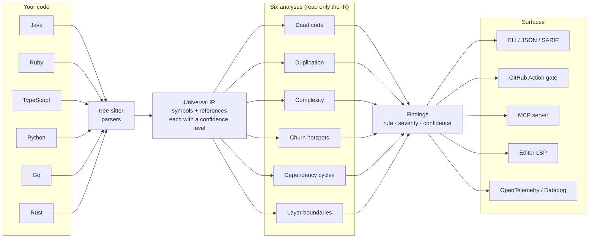

# Stratify

**One binary. Six languages. Six analyses. Findings you can trust.**

Stratify reads your whole repository, builds one language-agnostic model of it, and runs six static analyses on that model. Java, Ruby, TypeScript, Python, Go, and Rust all go through the same engine and the same commands. You get the same report shape whether your codebase is a Rails monolith, a Spring service, a Go module, a Rust workspace, or a mixed-language platform.

It runs on your laptop, in CI, inside your editor, next to your AI coding agent, and into your dashboards. No servers to run. No accounts to create.

```sh
stratify check .
```

```
warn  Unused.java:2  unused function `neverCalled`
info  App.java:6  possibly unused function `helper`

2 finding(s).
```

## How it flows

Six languages parse into one shared model. The six analyses read only that model, so they work the same everywhere. One stream of findings fans out to every surface.



## Why Stratify

**It speaks six languages, not one.** Most code-intelligence tools live in a single ecosystem. Stratify parses every supported language into one shared intermediate representation, so each analysis is written once and works everywhere. Your polyglot repo gets one consistent report.

**It tells you how sure it is.** Every finding carries a confidence level. When Stratify cannot prove a function is dead, it reports `possibly unused` instead of `unused`. It never hides a real finding behind a guess, and it never flags working code as dead just because resolution was hard. You can act on warnings and triage the rest.

**It meets you where you work.** The same analysis powers the CLI, a CI quality gate, SARIF for code scanning, an MCP server for AI agents, an editor language server, and OpenTelemetry export for fleet-wide dashboards.

## Install

**Homebrew** (macOS and Linux):

```sh
brew install stratify-dev/tap/stratify
```

**One-line installer** (macOS, Linux):

```sh
curl --proto '=https' --tlsv1.2 -LsSf https://github.com/stratify-dev/stratify/releases/latest/download/stratify-cli-installer.sh | sh
```

**Prebuilt binaries:** download a tarball for your platform from the [latest release](https://github.com/stratify-dev/stratify/releases/latest).

**From source** (needs a [Rust toolchain](https://rustup.rs)):

```sh
cargo install --git https://github.com/stratify-dev/stratify stratify-cli --locked
```

The binary is `stratify`. Run `stratify --help` to see every command.

## 60-second start

```sh
# Scan the current directory, readable output
stratify check .

# Scan a specific path
stratify check ./services/api

# Machine-readable output for scripts and pipelines
stratify check . --format json

# Fail the command when anything warning-or-worse shows up
stratify check . --fail-on warning
```

`--fail-on` accepts `never` (the default, always exits 0), `info`, `warning`, or `error`. Use it to turn any scan into a gate.

## The six analyses

They all run in a single pass. Java, Ruby, TypeScript, Python, and Go get all six; Rust gets the first four today (see below).

| Analysis | What it finds |
|----------|---------------|
| **Dead code** | Functions and methods nothing reaches, with cross-file call resolution |
| **Duplication** | Copy-pasted and renamed code blocks across files and languages |
| **Complexity** | Functions with high cyclomatic complexity, ranked by severity |
| **Churn hotspots** | Complex code that also changes often, the riskiest spots in the repo |
| **Dependency cycles** | Circular imports between files and packages |
| **Layer boundaries** | Imports that break your architecture rules |

Dead-code detection resolves calls across files, so a function used only from another file shows as `possibly unused` rather than a false `unused`. Cycle and boundary detection understand package-level imports for Go packages and Python `__init__.py`, so they see real dependencies, not just file-to-file edges.

## Six languages, one engine

Java, Ruby, TypeScript, Python, and Go each get the full set of six analyses. Rust gets dead code, duplication, complexity, and churn hotspots today. Dependency cycles and layer boundaries for Rust need module/`use` resolution, which is on the roadmap. Adding a language adds one adapter and changes no analysis code, because every analysis reads the shared model, not the source.

## Output formats

```sh
stratify check .                 # human-readable, great in a terminal
stratify check . --format json   # structured findings for tooling
stratify check . --format sarif  # SARIF 2.1.0 for code scanning
```

## CI quality gate (GitHub Action)

Drop Stratify into any workflow as a gate:

```yaml
- uses: actions/checkout@v4
- uses: stratify-dev/stratify@v0.4.0
  with:
    path: .
    fail-on: warning
```

The step fails the job when at least one finding meets or exceeds the `fail-on` threshold. Pin to a released tag for stable runs, for example `@v0.4.0`. `@main` tracks the latest. The Action downloads a prebuilt binary, so it starts in seconds.

### Action inputs

| Input | Default | Description |
|-------|---------|-------------|
| `path` | `.` | Directory to analyze. |
| `fail-on` | `warning` | Minimum severity that fails the step: `never`, `info`, `warning`, or `error`. |
| `format` | `human` | Output format: `human`, `json`, or `sarif`. |

## SARIF and GitHub code scanning

Stratify emits SARIF 2.1.0, so GitHub and GitLab render findings as inline annotations on pull requests.

```sh
stratify check . --format sarif > stratify.sarif
```

Upload it to GitHub code scanning:

```yaml
- uses: actions/checkout@v4
- uses: stratify-dev/stratify@v0.4.0
  with:
    fail-on: never
- run: stratify check . --format sarif > stratify.sarif
- uses: github/codeql-action/upload-sarif@v4
  with:
    sarif_file: stratify.sarif
```

The action installs the `stratify` binary and runs the gate. The follow-up step reuses that binary to write the SARIF file. Set `fail-on: never` on the action step when you want findings in code scanning without failing the build.

## AI coding agents (MCP server)

Stratify speaks the Model Context Protocol, so your coding agent can query findings directly instead of parsing terminal output.

```sh
stratify mcp
```

It runs a stdio JSON-RPC server with one tool, `analyze`, which takes a `path` and an optional `rule` filter and returns findings as JSON. Register it in any MCP client. For Claude Code:

```json
{
  "mcpServers": {
    "stratify": { "command": "stratify", "args": ["mcp"] }
  }
}
```

Your agent then calls `analyze` with `{ "path": ".", "rule": "dead_code" }` and gets structured results.

## Inline editor diagnostics (LSP)

Stratify ships a language server, so findings appear right in your editor.

```sh
stratify lsp
```

On open and save it analyzes the workspace and publishes diagnostics for all six analyses, each tagged with its rule as the diagnostic code. Point your editor's LSP client at `stratify lsp`. The server reads the workspace root from the `initialize` request.

## Fleet dashboards (OpenTelemetry and Datadog)

Track code health across every repo in one place. `stratify check` pushes results to any OpenTelemetry backend over OTLP. It emits only when an endpoint is configured and does nothing otherwise.

```sh
# Standard OpenTelemetry env vars
export OTEL_EXPORTER_OTLP_ENDPOINT=https://otlp.example.com
export OTEL_SERVICE_NAME=my-service   # optional, defaults to the git repo name
stratify check .

# Or pass them as flags, which override the env vars
stratify check . --otlp-endpoint https://otlp.example.com --project my-service
```

Each run sends gauges and one summary event:

- `stratify.findings` broken down by rule, severity, language, and confidence
- `stratify.complexity.max` and `stratify.complexity.mean`
- `stratify.cycles`, `stratify.boundary_violations`, `stratify.duplication.regions`
- `stratify.files_scanned`, `stratify.functions`, `stratify.scan.duration_ms`
- a `stratify.run` log event carrying the git commit, branch, and finding totals

Every run is tagged with `service.name`, so one dashboard templates across all your repos. The commit and branch ride on the event, never on a metric label, so your time-series stay clean.

**Datadog** ingests OTLP directly. Point the endpoint at Datadog's intake and pass your API key as a header:

```sh
export OTEL_EXPORTER_OTLP_ENDPOINT=https://otlp.datadoghq.com
export OTEL_EXPORTER_OTLP_HEADERS=DD-API-KEY=<your-key>
stratify check .
```

Telemetry never fails your scan. Export errors print a warning to stderr, and the exit code still follows `--fail-on`. Run it from CI and watch every project trend over time.

## Enforce your architecture (layer boundaries)

Describe your layers in a `stratify.toml` at the repo root and Stratify flags any import that crosses a forbidden boundary.

```toml
preset = "rails"   # or "layered" for controller/service/repository/domain
```

A preset ships layer globs and forbidden imports. The `rails` preset stops models from importing controllers, views, or mailers. The `layered` preset enforces the controller, service, repository, domain stack common in Spring, NestJS, and similar frameworks.

Add your own `[layers]` and `[[forbid]]` rules to extend or override a preset. Your layer keys replace preset keys of the same name. Your `[[forbid]]` rules are added to the preset rules.

```toml
preset = "rails"

[layers]
models = ["lib/models/**"]   # replaces the preset's app/models/** glob

[[forbid]]
from = "models"
to = "jobs"
```

With no `stratify.toml`, Stratify auto-detects a Rails app (an `app/controllers/` directory) or a Maven or Gradle project (`pom.xml` or `build.gradle`) and applies the matching preset. A project that matches no marker gets no boundary checks.

## Built to extend

The diagram above is the whole architecture. tree-sitter turns source into the Universal IR. The analyses read the IR, never the source, so they stay language-agnostic by construction. Adding a language means writing one adapter that emits the IR. The analyses come along for free. That is how Stratify went from one language to six without touching analysis code.

## Status

Six analyses across six languages (Rust covers four today, with cycles and boundaries pending import resolution), exposed through every surface: CLI, JSON, SARIF, GitHub Action, MCP, LSP, and OpenTelemetry export. Stratify lives at [github.com/stratify-dev/stratify](https://github.com/stratify-dev/stratify).
